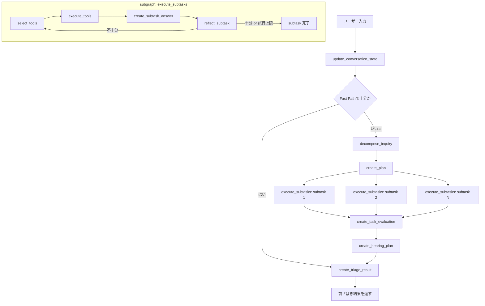

# 汎用お問い合わせ前さばきエージェント基盤 - agent_common

このディレクトリは、問い合わせを受けてすぐに最終回答するのではなく、前さばきに必要な判断を行うためのテンプレートです。

現在は、まず FAQ / ドキュメントでそのまま案内できるかを優先的に判断し、難しい場合だけ深い前さばきに進む構成です。
加えて、各ターンで会話状態を更新し、確認済み事実、解消できた部分、未解決部分、次の候補アクションを保持できます。

問い合わせ画面と管理画面の 2 つを持ち、問い合わせ処理と運用可視化の両方を 1 つのローカル構成で試せます。

## 現在できること

- FAQ / ドキュメントでそのまま案内できる問い合わせは Fast Path で返す
- 複合問い合わせや高リスク問い合わせは Deep Path で整理する
- サブタスクごとに FAQ 検索とドキュメント検索を使い分ける
- 検索結果をもとにサブタスク回答を作る
- サブタスク回答が十分かを自己評価し、必要なら再検索する
- 現在の根拠で前さばき判断が十分かを評価する
- 情報不足の場合に、追加で聞くべき項目と質問案を作る
- 追加確認後のユーザー回答を会話文脈として次ターンに引き継ぐ
- 各ターンで確認済み事実、未解決情報、解消できた部分、今回追加された情報を state として更新する
- 最終的に前さばき結果を構造化して返す
- Chainlit UI と Streamlit UI の両方で確認する
- 問い合わせログを JSON に蓄積し、管理画面で fast path / deep path / human handoff ごとに確認する
- 管理画面で件数カード、カテゴリ別集計、日次ボリューム、一覧、詳細を確認する
- 管理画面の詳細ビューで、回答根拠になった FAQ / ドキュメントを Relevant Articles として確認する

## 画面構成

### 問い合わせ画面

- Chainlit をメイン UI として使用
- 実行中は段階的な進捗表示を出す
- ユーザーには `draft_reply` と次の一手を中心に表示する
- 詳細な内部状態や JSON はそのまま見せない

### 管理画面

- Streamlit で運用ダッシュボードを提供
- `fast_path / deep_path / human_handoff` の件数をカード表示
- 経路別、カテゴリ別、日次件数を簡易チャート表示
- フィルタ付きの一覧表で問い合わせを確認
- 1件ごとの詳細で問い合わせ文、返信案、解消済み / 未解決、必須確認事項、引き継ぎ理由、Relevant Articles を確認

## 前さばき結果

最終的に返す出力には、主に以下を含みます。

- `category`
- `priority`
- `assigned_team`
- `resolved_parts`
- `unresolved_parts`
- `blocking_items`
- `optional_context`
- `immediate_guidance`
- `candidate_actions`
- `needs_follow_up`
- `next_user_action`
- `draft_reply`
- `handoff_needed`
- `handoff_target`
- `handoff_reason`
- `handoff_payload`
- `confidence`
- `reasoning_summary`

加えて、内部判断の確認用として以下も保持します。

- `decomposed_inquiry`
- `task_evaluation`
- `hearing_plan`
- `conversation_state`

`conversation_state` には主に以下を持ちます。

- `conversation_summary`
- `problem_summary`
- `user_goal`
- `sub_issues`
- `confirmed_facts`
- `blocking_items`
- `optional_context`
- `immediate_guidance`
- `candidate_actions`
- `resolved_parts`
- `unresolved_parts`
- `latest_user_update`

## 処理フロー

1. ユーザー問い合わせを受け取る
2. 前回 state と最新発話をもとに会話状態を更新する
3. まず FAQ / ドキュメント検索で Fast Path を試す
4. そのまま案内できるなら回答して終了する
5. 複合問い合わせ、高リスク、低ヒットの場合だけ Deep Path に進む
6. Deep Path では問い合わせ分解、計画、サブタスク実行、評価、追加確認を行う
7. 解消できた部分、未解決部分、追加確認要否、人への引き継ぎ要否を構造化して返す

## ワークフロー



## ディレクトリ構成

- `src/agent.py`: 前さばきエージェント本体
- `src/models.py`: 前さばき結果、会話状態、問い合わせ分解、評価、追加確認計画の型定義
- `src/prompts.py`: 前さばき、分解、評価、追加確認のプロンプト
- `src/knowledge_base.py`: JSON ベースのローカル検索
- `src/tools.py`: FAQ 検索とドキュメント検索のツール定義
- `chainlit_app.py`: 現在のメイン UI
- `streamlit_app.py`: 補助 UI
- `admin_app.py`: 問い合わせ管理画面
- `.chainlit/config.toml`: Chainlit 設定。ヘッダー右上の管理画面リンクもここで設定
- `scripts/build_knowledge_documents.py`: `documents/` 配下の `md/txt/csv/pptx/xlsx` を `knowledge_documents.json` に変換し、利用可能なら `ppt/xls` も取り込む
- `data/knowledge_documents.json`: ドキュメント検索用データ
- `data/faq_items.json`: FAQ 検索用データ
- `data/inquiry_logs.json`: 問い合わせログ保存先
- `documents/`: ドキュメント取り込み元

## セットアップ

### 1. `agent_common` を開く

```bash
cd /Users/ryota/Desktop/エージェント作成/genai-agent-advanced-book/agent_common
```

### 2. 環境変数を設定する

`.env.sample` をもとに `.env` を作成し、OpenAI API キーを設定してください。

```env
OPENAI_API_KEY=your_openai_api_key
OPENAI_API_BASE=https://api.openai.com/v1
OPENAI_MODEL=gpt-4.1-mini

DOMAIN_NAME=サポート対象サービス
ASSISTANT_ROLE=問い合わせ対応エージェント
KNOWLEDGE_LABEL=製品ドキュメント
FAQ_LABEL=FAQ
MAX_CHALLENGE_COUNT=3
```

### 3. 依存関係を入れる

```bash
make sync
```

### 4. UI を起動する

Chainlit UI:

```bash
make run.ui
```

`make run.ui` では、Chainlit の問い合わせ画面に加えて、管理画面も同時に起動します。

Streamlit UI:

```bash
make run.ui.streamlit
```

管理画面:

```bash
make run.admin
```

Chainlit のヘッダー右上にある `管理画面` リンクからも遷移できます。

## ログ保存

問い合わせ結果は `data/inquiry_logs.json` に追記保存します。

保存する主な項目:

- 問い合わせ文
- 実行経路 (`fast_path` / `deep_path`)
- ルーティング結果 (`fast_path` / `deep_path` / `human_handoff`)
- カテゴリ
- 優先度
- 担当先
- ユーザー向け返信案
- 次の一手
- 解消済み部分
- 未解決部分
- 必須確認事項

この JSON をそのまま管理画面が読み込みます。現時点では DB は使っていません。

## 最小のドキュメント取り込み

`documents/` 配下にファイルを置き、次を実行してください。

```bash
make build.knowledge
```

これで `data/knowledge_documents.json` が再生成されます。

- `documents/` は再帰的に走査されます
- 対応形式は `md / txt / csv / pptx / xlsx` です
- `ppt / xls` は、変換ツールや任意ライブラリが利用できる環境では取り込みます
- Markdown は最初の見出しを `title` に使います
- 親ディレクトリ名を `tags` に入れます
- 現時点では PDF や Word は未対応です

## カスタマイズ方法

1. `data/knowledge_documents.json` に業務ドキュメントを入れる
2. `data/faq_items.json` によくある問い合わせを入れる
3. `.env` の `DOMAIN_NAME` などを自分のサービス名に変える
4. `documents/` からドキュメントを生成したい場合は `make build.knowledge` を実行する
5. 必要なら `src/tools.py` に検索ツールを追加する

## データ形式

`knowledge_documents.json`

```json
[
  {
    "title": "パスワードポリシー",
    "content": "パスワードは12文字以上...",
    "tags": ["認証", "セキュリティ"]
  }
]
```

`faq_items.json`

```json
[
  {
    "question": "最新リリースはどこで確認できますか？",
    "answer": "管理画面のリリースノートから確認できます。",
    "tags": ["リリース"]
  }
]
```

## これから精度を上げるためにやるべきこと

- マルチターン対応を強化する
  - 現在は UI セッション内で会話状態を保持する段階で、外部保存や担当者交代をまたぐ継続には未対応
- 引き継ぎオペレーションを明確化する
  - `handoff_target` や `handoff_payload` を実在の窓口、テンプレート、連絡チャネルに接続する
- カテゴリ体系と担当先マスタを外出しする
  - `category` と `assigned_team` を自由文ではなく、管理された候補から選ばせる
- 優先度判定ルールを明示化する
  - 影響度、緊急度、期限、障害範囲などで判定ルールを持たせる
- ナレッジ投入を強化する
  - PDF、Word、HTML、社内 wiki などを取り込み対象に広げる
- FAQ とドキュメントの自動整備を追加する
  - `faq_items.json` の生成導線も用意する
- 検索精度を上げる
  - 現在は単純なトークン一致なので、将来的には埋め込み検索や rerank を検討する
- 実行ログと評価ログを残す
  - 現在は JSON ログのみなので、将来的には集計しやすい永続化先や監査ログ形式も検討する
- 追加確認の質問数を制御する
  - 必要最小限の質問に絞り、聞きすぎを防ぐ
- 解決済み / 未解決の論点更新を安定化する
  - `resolved_parts` と `unresolved_parts` の更新をより規則的にし、同じ質問の繰り返しを防ぐ
- 実運用向けのガードレールを入れる
  - 推測禁止、個人情報の扱い、エスカレーション条件の明文化
- 回帰テストを用意する
  - 代表的な問い合わせに対して、分類、優先度、担当先、追加確認内容が崩れていないかを検証する

## 補足

- このテンプレートは Docker や外部検索エンジンに依存せず、ローカル JSON と OpenAI API だけで動きます
- 現時点では API を使った実行品質のチューニングよりも、前さばき工程の構造化を優先しています
