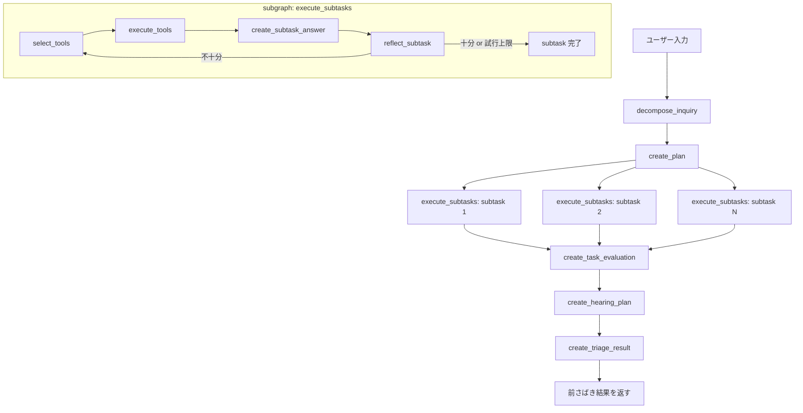

# 汎用お問い合わせ前さばきエージェント基盤 - agent_common

このディレクトリは、問い合わせを受けてすぐに最終回答するのではなく、前さばきに必要な判断を行うためのテンプレートです。

現在は、問い合わせの整理、検索、根拠確認、追加確認計画の作成、前さばき結果の構造化出力までを一通り実行できます。

## 現在できること

- 問い合わせを正規化し、複合問い合わせを分解する
- 分解結果をもとに前さばき用のサブタスク計画を作る
- サブタスクごとに FAQ 検索とドキュメント検索を使い分ける
- 検索結果をもとにサブタスク回答を作る
- サブタスク回答が十分かを自己評価し、必要なら再検索する
- 現在の根拠で前さばき判断が十分かを評価する
- 情報不足の場合に、追加で聞くべき項目と質問案を作る
- 最終的に前さばき結果を構造化して返す
- Chainlit UI と Streamlit UI の両方で確認する

## 前さばき結果

最終的に返す出力には、主に以下を含みます。

- `category`
- `priority`
- `assigned_team`
- `missing_information`
- `needs_follow_up`
- `draft_reply`
- `confidence`
- `reasoning_summary`

加えて、内部判断の確認用として以下も保持します。

- `decomposed_inquiry`
- `task_evaluation`
- `hearing_plan`

## 処理フロー

1. ユーザー問い合わせを受け取る
2. 問い合わせを正規化し、必要なら複数論点に分解する
3. 前さばきに必要なサブタスクを計画する
4. サブタスクごとに検索ツールを選び、根拠を取得する
5. サブタスク回答を作り、十分なら採用、不十分なら再試行する
6. 全体として前さばき根拠が十分かを評価する
7. 根拠不足なら追加確認プランを作る
8. 前さばき結果を構造化して返す

## ワークフロー



## ディレクトリ構成

- `src/agent.py`: 前さばきエージェント本体
- `src/models.py`: 前さばき結果、問い合わせ分解、評価、追加確認計画の型定義
- `src/prompts.py`: 前さばき、分解、評価、追加確認のプロンプト
- `src/knowledge_base.py`: JSON ベースのローカル検索
- `src/tools.py`: FAQ 検索とドキュメント検索のツール定義
- `chainlit_app.py`: 現在のメイン UI
- `streamlit_app.py`: 旧 UI
- `scripts/build_knowledge_documents.py`: `documents/` 配下の `md/txt` を `knowledge_documents.json` に変換
- `data/knowledge_documents.json`: ドキュメント検索用データ
- `data/faq_items.json`: FAQ 検索用データ
- `documents/`: ドキュメント取り込み元

## セットアップ

### 1. `agent_common` を開く

```bash
cd /Users/ryota/Desktop/エージェント作成/genai-agent-advanced-book/agent_common
```

### 2. 環境変数を設定する

`.env.sample` をもとに `.env` を作成し、OpenAI API キーを設定してください。

```env
OPENAI_API_KEY=your_openai_api_key
OPENAI_API_BASE=https://api.openai.com/v1
OPENAI_MODEL=gpt-4.1-mini

DOMAIN_NAME=サポート対象サービス
ASSISTANT_ROLE=問い合わせ対応エージェント
KNOWLEDGE_LABEL=製品ドキュメント
FAQ_LABEL=FAQ
MAX_CHALLENGE_COUNT=3
```

### 3. 依存関係を入れる

```bash
make sync
```

### 4. UI を起動する

Chainlit UI:

```bash
make run.ui
```

Streamlit UI:

```bash
make run.ui.streamlit
```

## 最小のドキュメント取り込み

`documents/` 配下に `md` または `txt` ファイルを置き、次を実行してください。

```bash
make build.knowledge
```

これで `data/knowledge_documents.json` が再生成されます。

- `documents/` は再帰的に走査されます
- Markdown は最初の見出しを `title` に使います
- 親ディレクトリ名を `tags` に入れます
- 現時点では PDF や Word は未対応です

## カスタマイズ方法

1. `data/knowledge_documents.json` に業務ドキュメントを入れる
2. `data/faq_items.json` によくある問い合わせを入れる
3. `.env` の `DOMAIN_NAME` などを自分のサービス名に変える
4. `documents/` からドキュメントを生成したい場合は `make build.knowledge` を実行する
5. 必要なら `src/tools.py` に検索ツールを追加する

## データ形式

`knowledge_documents.json`

```json
[
  {
    "title": "パスワードポリシー",
    "content": "パスワードは12文字以上...",
    "tags": ["認証", "セキュリティ"]
  }
]
```

`faq_items.json`

```json
[
  {
    "question": "最新リリースはどこで確認できますか？",
    "answer": "管理画面のリリースノートから確認できます。",
    "tags": ["リリース"]
  }
]
```

## これから精度を上げるためにやるべきこと

- 真のマルチターン対応を入れる
  - 追加確認後のユーザー回答を次ターンへ引き継ぎ、前回の `hearing_plan` と結びつける
- カテゴリ体系と担当先マスタを外出しする
  - `category` と `assigned_team` を自由文ではなく、管理された候補から選ばせる
- 優先度判定ルールを明示化する
  - 影響度、緊急度、期限、障害範囲などで判定ルールを持たせる
- ナレッジ投入を強化する
  - PDF、Word、HTML、社内 wiki などを取り込み対象に広げる
- FAQ とドキュメントの自動整備を追加する
  - `faq_items.json` の生成導線も用意する
- 検索精度を上げる
  - 現在は単純なトークン一致なので、将来的には埋め込み検索や rerank を検討する
- 実行ログと評価ログを残す
  - どの問い合わせで何を根拠に判断したかを追えるようにする
- 追加確認の質問数を制御する
  - 必要最小限の質問に絞り、聞きすぎを防ぐ
- 実運用向けのガードレールを入れる
  - 推測禁止、個人情報の扱い、エスカレーション条件の明文化
- 回帰テストを用意する
  - 代表的な問い合わせに対して、分類、優先度、担当先、追加確認内容が崩れていないかを検証する

## 補足

- このテンプレートは Docker や外部検索エンジンに依存せず、ローカル JSON と OpenAI API だけで動きます
- 現時点では API を使った実行品質のチューニングよりも、前さばき工程の構造化を優先しています
